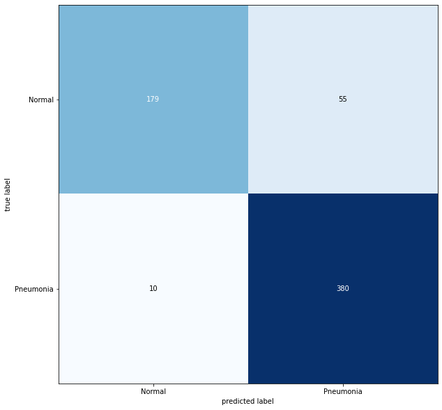

# pneumonia_classification

## Starting the fastapi server
The Server can be started either in a docker-compose network or on your localhost.

To start on the localhost, run `make runserver` in the project root directory.
You can stop the server with ctrl+c at any time.

To start a docker-compose running using the Dockerfile, run 

`make dc-up`

To inspect logs of the fastapi container, run 

`make dc-logs`

To stop the docker-compose network run 

`make dc-down`.

The server will in both cases be listening to port 8000 on your localhost.
Therefore, you can not run both the local server and the docker-compose network at the same time.

## Network Training
The Network was trained using google colab using the provided notebook in the notebooks folder.
The Data has to be uploaded to your personal drive folder and you have to adjust the file paths to recreate.

## Quality
The Network achieved an Accuracy of 0.8958333333333334 with a Recall of 0.9743589743589743.
It used class_weights to combat the existing class imbalance.

The Confusion Matrix for the Test Data is as follows:

## Improvements
Instead of using class_weights, data augmentation to balance the dataset could help to further improve accuracy and recall.

Other possible Improvements include:
  - tuning the hyperparameters using e.g. [hyperas](https://github.com/maxpumperla/hyperas)
  - using other architectures e.g. networks with conv-conv-pool blocks
  - using transfer learning on e.g. the vgg16 imagenet network
  
These possabilities were not tested yet.
